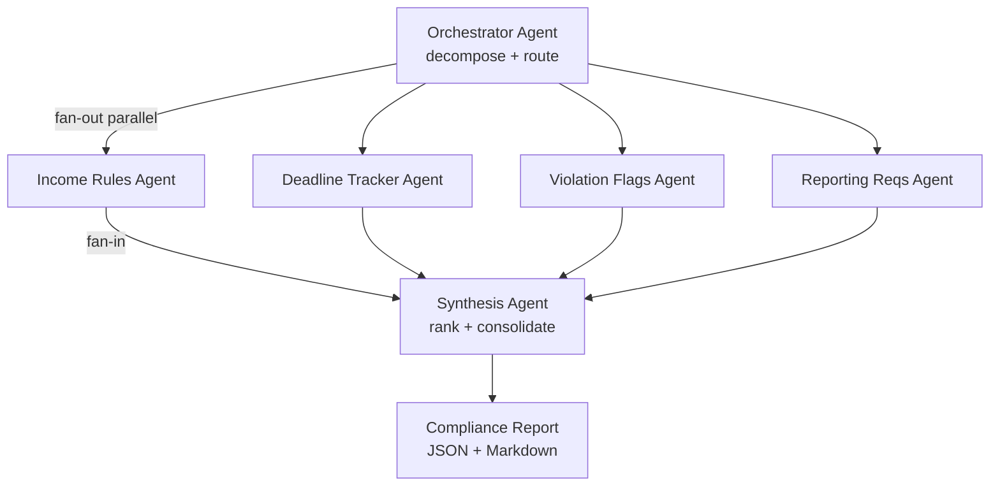

# AGENTS.md — Parallel Compliance Document Analyzer

## System Overview

This system analyzes HUD/LIHTC/HOME/USDA regulatory documents using a
parallel fan-out architecture. An orchestrator decomposes the document,
fans out to 4 specialized agents simultaneously, then synthesizes ranked
findings into a compliance checklist.

## Architecture

## Agents

| Agent              | Role                                      | Inputs              | Outputs              | Hands Off To   |
|--------------------|-------------------------------------------|---------------------|----------------------|----------------|
| Orchestrator       | Splits doc into sections, routes parallel | Raw PDF text        | 4 section payloads   | All 4 agents   |
| IncomeRulesAgent   | Extracts income limits, AMI thresholds    | Section payload     | IncomeFindings       | Synthesizer    |
| DeadlineAgent      | Extracts reporting and recert deadlines   | Section payload     | DeadlineFindings     | Synthesizer    |
| ViolationFlagAgent | Identifies non-compliance risk indicators | Section payload     | ViolationFindings    | Synthesizer    |
| ReportingReqAgent  | Extracts required forms and submissions   | Section payload     | ReportingFindings    | Synthesizer    |
| SynthesisAgent     | Ranks all findings, resolves conflicts    | All 4 findings      | RankedChecklist      | Output writer  |

## Typed boundary schemas

Schemas are defined in `schemas/models.py` (Pydantic v2, `strict=True`).

### Orchestrator

- **Input:** raw document text (`str`), `DocumentMetadata` (program type, state, effective date).
- **Output:** `sections: dict[str, str]` (keys: `income`, `deadlines`, `violations`, `reporting`), `run_id: str`, `routing_log: list[str]`, `program_type: str`, `confidence_in_routing: float`.

### Specialized agents (parallel)

- **Input:** `section_text: str`, `program_type: str`, `state: str` (US state or jurisdiction code), plus accumulated `PipelineState` as needed for audit/checkpointing.
- **Output:** one domain findings model each — `IncomeFindings`, `DeadlineFindings`, `ViolationFindings`, `ReportingFindings` (each includes `confidence: float` and citations or structured sub-objects).

### Synthesis agent

- **Input:** all four findings models above.
- **Output:** `RankedChecklist` (`items: list[ChecklistItem]` sorted by severity, `overall_risk_score`, `human_review_flags`, `synthesis_notes`).

### Persistence / orchestration

- **Pipeline state:** `PipelineState` (`TypedDict`) in `schemas/models.py` — list fields that must grow across steps use `Annotated[list, operator.add]` reducers for LangGraph.
- **Artifacts:** Markdown + JSON reports under `outputs/`; SQLite checkpoints under `state/` (per `run_id`).
