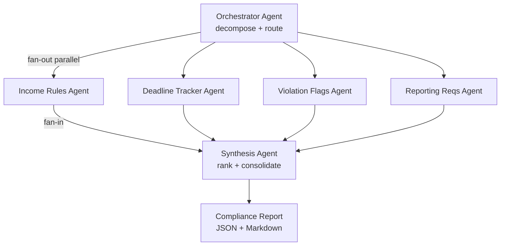

# Parallel Compliance Document Analyzer

**Repository:** [github.com/HirenDos/parallel-compliance-analyzer](https://github.com/HirenDos/parallel-compliance-analyzer)

One-line pitch: **a LangGraph “fan-out” pipeline that turns long HUD-style PDFs
into a ranked compliance checklist by running four specialist agents in parallel,
then synthesizing their outputs with a final consolidation agent.**

## Design pattern

Modern document review often mixes unrelated analytical tasks: income math,
timing windows, risk language, and form inventories. Those tasks are *mostly
independent* once a page range or paragraph bundle is known.

This project demonstrates **Fan-Out → Specialized Sub‑Agents → Ranked Synthesis**:

1. **Fan-out / orchestration** — deterministic splitting of text into thematic
   slices (income, deadlines, violations, reporting).
2. **Parallel specialists** — four Claude-powered agents analyze their slice at
   the same time via LangGraph `Send()`, shrinking wall-clock latency versus a
   strictly sequential chain.
3. **Ranked synthesis** — a final agent merges every JSON finding into a single
   checklist ordered by severity, adds a portfolio-friendly risk score, and calls
   out anything that needs a human compliance officer.

## Architecture



## Why parallel beats sequential here

- **Latency** — Compliance reviews are interactive; waiting for four sequential
  LLM calls multiplies wait time by ~4× in the worst case, whereas parallel
  subgraphs overlap network + inference time.
- **Separation of concerns** — Income extraction prompts stay narrow; they don’t
  “fight” reporting-form prompts inside one mega prompt. That reduces
  cross-domain omissions when context is capped.
- **Graceful degradation** — Each branch returns structured JSON with its own
  confidence; synthesis can respect partial failures without restarting the
  entire scan (see `schemas/models.py` and `agents/*/INSTRUCTIONS.md`).

## Domain context: why LLMs for HUD / LIHTC workflows?

Traditional engines encode **known** rules beautifully, but housing policy text
arrives as **long, versioned PDFs** mixing tables, cross-references, and narrative
exceptions (student rules, over-income carve-outs, notice timing). Hard-coded
parsers are expensive to maintain across notice updates, and brittle when a
single paragraph combines income + penalty language.

LLM-backed extraction (with deterministic validation via Pydantic) lets this
demo highlight **portfolio-ready orchestration**: structured output, traceable
citations inside JSON, and a synthesis pass that mirrors how compliance leads
actually triage risk.

## Setup

```bash
git clone https://github.com/HirenDos/parallel-compliance-analyzer.git
cd parallel-compliance-analyzer
poetry install
cp .env.example .env   # set ANTHROPIC_API_KEY (optional: CLAUDE_MODEL)
poetry run python main.py --input sample_inputs/sample_hud_regulation.txt \
  --program HUD --state CA --output outputs/report.md
```

PDF input (extracted with `pdfplumber`):

```bash
poetry run python main.py --input sample_inputs/irs8609.pdf \
  --program LIHTC --state CA --output outputs/irs8309report.md
```

**Sample input and output (review in browser):**

- Input PDF: [sample_inputs/irs8609.pdf](sample_inputs/irs8609.pdf)
- Output report: [outputs/irs8309report.md](outputs/irs8309report.md) ([JSON](outputs/irs8309report.json))

Outputs:

- `outputs/<run_id>_report.md` — narrative checklist for humans
- `outputs/<run_id>_report.json` — the same `RankedChecklist` as JSON
- `state/<run_id>.db` — SQLite checkpoints for LangGraph (`SqliteSaver`)

## Sample checklist output (illustrative)

Below is a **representative** slice of what synthesis aims to produce — not live
runtime output:

```json
{
  "items": [
    {
      "title": "Complete annual recertifications in the 120-day window",
      "action": "Schedule recertification tasks so each household finishes within 120 days of its prior anniversary.",
      "consequence": "Missed windows are treated as administrative defects and may cascade into audit findings.",
      "severity": "HIGH",
      "source_agents": ["deadline", "violation"],
      "confidence": 0.82,
      "needs_human_review": false
    },
    {
      "title": "Maintain HUD-50059 packets for every income change",
      "action": "Ensure each admission and recert folder includes a completed HUD-50059 record.",
      "consequence": "Incomplete files break traceability during HUD financial or household-data audits.",
      "severity": "MEDIUM",
      "source_agents": ["reporting"],
      "confidence": 0.76,
      "needs_human_review": false
    }
  ],
  "overall_risk_score": 78,
  "human_review_flags": [
    "Violation findings below confidence threshold in automated pass — spot-check citations."
  ],
  "synthesis_notes": "- Anchored HIGH items on termination/audit language. - Overall score weights violation severity (40%), deadline exposure (35%), reporting completeness (25%)."
}
```

## Stateful orchestration & `--resume`

The compiled graph sets `interrupt_before=["synthesizer"]` so operators can pause
after parallel agents finish but before consolidation — mirroring “human review
gates” in real control environments. The CLI automatically calls `invoke(None,
...)` after streaming updates, but if you intentionally stop mid-run you can
point the checkpointer at the saved SQLite file and continue with the same
`thread_id`:

```bash
poetry run python main.py --resume <run_id>
```

Here `run_id` matches both the SQLite filename `state/<run_id>.db` and LangGraph’s
`configurable.thread_id`.

## Tech stack

| Layer | Technology |
| --- | --- |
| Orchestration & parallelism | LangGraph `StateGraph`, `Send()`, SQLite checkpoints |
| Model | Anthropic Claude (Sonnet class model ID configurable via `CLAUDE_MODEL`) |
| PDF ingestion | `pdfplumber` helpers in `skills/pdf_extractor.py` |
| Schemas / IO contracts | Pydantic v2 strict models (`schemas/models.py`) |
| CLI UX | `argparse` + `rich` tables/panels in `main.py` |

## Portfolio note

This repository is **Project 1 / 7** in a multi-repo AI agents portfolio aimed at
showing production-minded orchestration—not notebook demos. The emphasis is typed
boundaries, audit logs, and honest confidence scoring rather than “magic
prompts.”

## License

Copyright © 2026 [Hiren Doshi](https://github.com/HirenDos). All rights reserved.

This repository is for portfolio and demonstration purposes only. **Commercial use is not permitted** without prior written permission. See [LICENSE](LICENSE) for full terms.
